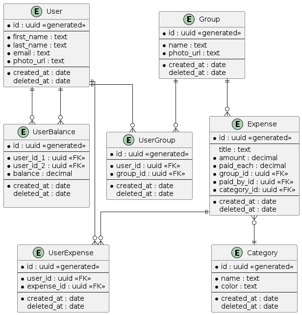

This is a [Next.js](https://nextjs.org/) project bootstrapped with [`create-next-app`](https://github.com/vercel/next.js/tree/canary/packages/create-next-app).

## Getting Started

Firstly, install `bun`:

```bash
npm install -g bun
```

Install packages:

```bash
bun i
```

Run the development server:

```bash
bun dev
```

Push changes to database server:

```bash
npx drizzle-kit push:sqlite
```

Open [http://localhost:3000](http://localhost:3000) with your browser to see the result.

You can start editing the page by modifying `app/page.tsx`. The page auto-updates as you edit the file.

This project uses [`next/font`](https://nextjs.org/docs/basic-features/font-optimization) to automatically optimize and load Inter, a custom Google Font.

## Branch and commit naming

### Branch naming

In this project, we follow a branch naming convention to keep things organized:

1. All branch names should be in lowercase.
2. Use forward slashes to separate the branch type from its description.
3. The name should start with the branch type (e.g., `feat`, `fix`).
4. After the type, add a short description of the branch's purpose (e.g., `feat/user-authentication`, `fix/button-color`).

### Commit naming

We follow the [Conventional Commits](https://www.conventionalcommits.org/) specification for commit messages. Here are the key rules:

1. The commit message should be structured as `<type>[optional scope]: <description>`
2. `<type>` is one of the following: `feat`, `fix`, `docs`, `style`, `refactor`, `perf`, `test`, `build`, `ci`, `chore`, `revert`.
3. `<optional scope>` can be anything specifying the place of the commit change.
4. `<description>` is a short description of the changes.
5. If the change introduces a breaking change, it should be noted as `BREAKING CHANGE:` in the footer or `!` after the type/scope.

Here are some examples of commit messages: (scope is optional)

- A new feature commit: `feat(user-auth): add login functionality`
- A bug fix commit: `fix(button-color): correct the primary button color`
- A commit for code style updates: `style(login-form): fix indentation`

Remember, these conventions aim to make the version control process smoother and the project easier to manage.

## Folder structure

Preferred folder structure we should stick to:

- `src`
  - `app`
    - `(app)` - defined pages, route groups etc.
    - `api` - api related stuff, routes
  - `components`
    - `ui` - generally used components (button, dialog, input etc.) (mostly [shadcn](https://ui.shadcn.com/docs/components) - please check the link for example usage)
    - `component1.tsx`
    - `component2.tsx`
    - `feature` - folder grouping components for some feature
  - `lib` - useful functions
    - `hooks` - hooks used across the app
      - `use-toast.tsx`
    - `feature.ts` - functions related to some feature
  - `queries` - tanstack queries (one query/mutation === one file)
    - `expenses` - folder grouping all queries for some feature
      - `useGetExpenses.ts`
      - `usePatchExpenses.ts`
  - `store` - contexts folder
    - `auth-context.tsx`
  - `schema`
    - `auth.ts` - all schemas for some feature (eg. loginSchema, registerSchema)
    - `feature.ts`


## App routes
**(unauthorized)**
- /login
- /register

**(authorized)**
- /dashboard - first page, summary info, (statistics??) recent groups, recent transaction etc.
- /group - all users groups, filter groups, create group, invitation by email
- /group/[id] - group detail, members, expenses (filterable by category or payer)
- /profile - user info (edit) 
- /expenses -> all expenses among two(or more) people


## Entity Relationship Diagram
- in case you will edit the ERD file during the database initialisation (or for other reasons), don't forget to generate a new `png` using the following command:

```bash
plantuml erd.plantuml
```

